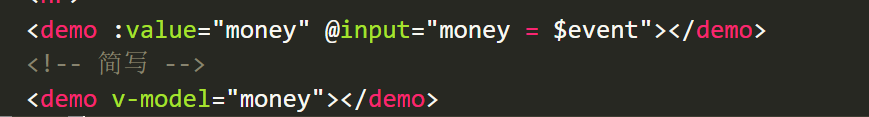

# 案例 - TabBar

## 案例概览


知识点:

- 组件封装
- 动态组件
- keep-alive
- 作用域插槽
- 自定义指令

## 搭建项目基本结构

- 初始化项目

- 引入 bootstrap.css

## 封装 my-header 组件


### my-header 组件封装要求

1. 允许用户自定义  **title 标题**
2. 允许用户自定义  **bgcolor 背景色**
3. 允许用户自定义color 颜色
4. my-header 组件需要在页面顶部进行  fixed 固定定位
5. 使用示例如下：

```jsx
<!-- 头部区域 -->
<my-header color="#fff" bgcolor="red">我是标题</my-header>
```

### my-header 组件

- 创建 components/MyHeader.vue 组件

```vue
<template>
  <div class="my-header">
    我是标题
  </div>
</template>

<script>
export default {
}
</script>

<style lang="less" scoped>
.my-header {
  height: 50px;
  line-height: 50px;
  text-align: center;
  font-size: 16px;
  background-color: red;
  color: #fff;
  position: fixed;
  left: 0;
  top: 0;
  width: 100%;
}
</style>
```

- 在App.vue中局部注册组件

```jsx
<script>
import MyHeader from './components/MyHeader'
export default {
  components: {
    MyHeader
  }
}
</script>
```

- 在App.vue中使用组件

```html
<template>
  <div id="app">
    <my-header></my-header>
  </div>
</template>
```

## my-header组件-动态处理插槽和数据

- 封装的时候提供插槽和接受props

```jsx
<template>
  <div class="my-header" :style="{color: color, backgroundColor: bgColor}">
    <slot>我是标题</slot>
  </div>
</template>

<script>
export default {
  props: {
    bgColor: {
      type: String,
      default: 'skyblue'
    },
    color: {
      type: String,
      default: '#fff'
    }
  }
}
</script>
```

- 使用的时候传入插槽和props

```jsx
<template>
  <div id="app">
    <my-header color="red" bgColor="pink">TabBar案例</my-header>
  </div>
</template>
```

## 封装 my-tab-bar 组件

### 基本封装说明


1. 用户通过名为 `tabs` 的 prop 属性，为 tabbar 组件指定数据源
2. 数据源的限制:  tabbar 的 item 项最少 2 个，最多 5 个
3. 每个 tabbar 的 item 配置项，至少要包含如下两个属性：
   - icon -> 要展示的图标
   - text -> 显示的文本

### 基本创建 my-tab-bar 组件

```vue
<template>
  <div class="my-tab-bar">
    <div class="tab-item current">
      <span class="iconfont icon-shangpinliebiao"></span>
      <span>商品列表</span>
    </div>
    <div class="tab-item">
      <span class="iconfont icon-sousuo"></span>
      <span>商品搜索</span>
    </div>
    <div class="tab-item">
      <span class="iconfont icon-user"></span>
      <span>用户中心</span>
    </div>
  </div>
</template>

<script>
export default {
}
</script>

<style lang="less" scoped>
.my-tab-bar {
  position: fixed;
  left: 0;
  bottom: 0;
  width: 100%;
  height: 50px;
  border-top: 1px solid #ccc;
  display: flex;
  justify-content: space-around;
  align-items: center;
  .tab-item {
    display: flex;
    flex-direction: column;
    align-items: center;
    .iconfont {
      font-size: 18px;
    }
  }
  .current {
    color: #1d7bff;
  }
}
</style>
```

- 在App.vue中导入且使用

```jsx
<script>
import MyHeader from './components/MyHeader'
import MyTabBar from './components/MyTabBar'
export default {
  components: {
    MyHeader,
    MyTabBar
  }
}
</script>

<template>
  <div id="app">
    <my-header color="red" bgColor="pink">TabBar案例</my-header>
    <my-tab-bar></my-tab-bar>
  </div>
</template>
```

- 引入字体图标

```js
//main.js
// 导入字体图标
import './fonts/iconfont.css'
```

### 处理MyTabBar的校验

- 在App.vue中准备tabList数据

```jsx
data () {
  return {
    // tab栏的数据
    tabList: [
      { icon: 'icon-shangpinliebiao', title: '商品列表' },
      { icon: 'icon-sousuo', title: '商品搜索' },
      { icon: 'icon-user', title: '用户中心' }
    ]
  }
}
```

- 通过父传子的方式，把数据传给MyTabBar组件

```jsx
<my-tab-bar :tabList="tabList"></my-tab-bar>
```

- 子组件需要接受tabList,,,,添加prop的校验

```jsx
export default {
  props: {
    tabList: {
      type: Array,
      // 必须传
      required: true,
      // props的自定义校验
      validator (value) {
        // 校验长度必须是2-5位
        if (value.length >= 2 && value.length <= 5) {
          return true
        } else {
          console.error('tabList长度必须是2-5位')
          return false
        }
      }
    }
  }
}
```

- 渲染tabBar

```jsx
<template>
  <div class="my-tab-bar">
    <div class="tab-item current" v-for="item in tabList" :key="item.title">
      <span class="iconfont" :class="item.icon"></span>
      <span>{{item.title}}</span>
    </div>
  </div>
</template>

```

### 控制MyTabBar的高亮

- 在App.vue组件中提供了一个属性active 用于控制高亮


- App.vue把active传递给MyTabBar组件


- MyTabBar组件需要接受active属性


- MyTabBar根据active属性控制高亮 current


### 点击tabBar,修改父组件的active

- 给tabBar注册点击事件


- 子传父，把下标传递给父组件


- 父组件接受，并且修改active


## v-model语法糖

> 语法糖：v-model本质上是 value属性和input事件的一层包装

```jsx
/* 
  v-model的作用：提供数据的双向绑定
    数据发生了改变，页面会自动变  v-bind:value
    页面输入的时候（改变） 数据会自动变化  v-on:input
   v-model是语法糖， v-model等价于 给一个input框提供了 :value属性以及 @input事件，但是如果每次使用input框，都需要提供value和input事件比较麻烦，所以使用v-model
*/

<template>
  <div>
    <input type="text" v-model="msg">
    <input type="text" :value="msg" @input="msg = $event.target.value">

    <input type="text" :value="car" @input="car = $event.target.value">
    <input type="text" v-model="car">
  </div>
</template>
```

## v-model给表单元素使用

> 我们经常遇到一种场景： 父组件提供一个数据给子组件使用（父传子），，，子组件需要修改父组件的数据，所以需要子传父把值传给父组件。 这种场景可以使用v-model进行简写。

- 定义组件的时候，注意接收的值叫value,,,子传父触发的事件叫 input


- 父传子给子组件传递value属性和input事件



## 实现组件的动态切换

### 创建组件

创建 tabbar 对应的 3 个组件

1. 在  components 目录下创建  my-goods-list.vue 组件
2. 在  components 目录下创建  my-goods-search.vue 组件
3. 在  components 目录下创建  my-user-info.vue 组件

在 App.vue 中导入并注册对应的 3 个组件

```jsx
import MyHeader from "./components/my-header.vue";
import MyTabBar from "./components/my-tab-bar.vue";
import MyUserInfo from "./components/my-user-info.vue";
import MyGoodsList from "./components/my-goods-list.vue";
import MyGoodsSearch from "./components/my-goods-search.vue";
export default {
  components: {
    MyHeader,
    MyTabBar,
    // 导入三个组件
    MyUserInfo,
    MyGoodsList,
    MyGoodsSearch,
  },
}
```

### 在页面中使用动态组件

 1 通过 `<components>` 标签动态渲染组件

```html
<component :is="'my-goods-list'"></component>
```

2 为  tablist 数组中的每个配置对象，都添加  name 属性，属性值是每个 tab 项 要展示的页面的名称

```jsx
data() {
  return {
    tabList: [
      {
        icon: "icon-shangpinliebiao",
        text: "商品列表",
        name: "my-goods-list",
      },
      {
        icon: "icon-sousuo",
        text: "商品搜索",
        name: "my-goods-search",
      },
      {
        icon: "icon-user",
        text: "我的信息",
        name: 'my-user-info'
      },
    ],
    activeIndex: 0,
  };
},
```

3 通过计算属性，动态计算出当前要展示的组件的名称：

```jsx
<component :is="activeName"></component>

computed: {
  activeName () {
    return this.tabList[this.activeIndex].name
  }
}
```

### 为动态组件开启状态保持

在  `<component>` 组件之外使用  `<keep-alive>`组件进行包裹，从而为动态组件开启状态保持。

示例代码如下：

```jsx
<keep-alive>
  <component :is="activeName"></component>
</keep-alive>
```

## my-goods-list 组件 - 获取数据

安装 axios

``` bash
yarn add axios
```

发送请求获取数据

```jsx
<template>
  <div>商品列表</div>
</template>

<script>
import axios from 'axios'
export default {
  data () {
    return {
      // 商品列表数据
      goodsList: []
    }
  },
  created () {
    this.getGoodsList()
  },
  methods: {
    // 初始化商品的数据
    async getGoodsList () {
      // 发送ajax请求
      const res = await axios.get('https://www.escook.cn/api/goods')
      const { status, data } = res.data
      if (status !== 0) return console.log('获取商品列表失败')
      // 请求成功
      this.goodsList = data
      console.log(data)
    }
  }
}
</script>

<style>

</style>
```

## 封装 my-table 组件

### 基本表格组件结构

新建 `my-table.vue` 组件

```jsx
<template>
  <table class="table table-bordered table-stripped">
    <!-- 表格标题区域 -->
    <thead>
      <tr>
        <th>#</th>
        <th>商品名称</th>
        <th>价格</th>
        <th>标签</th>
        <th>操作</th>
      </tr>
    </thead>
    <!-- 表格主体区域 -->
    <tbody>
      <tr v-for="item in data" :key="item.id">
        <td>1</td>
        <td>商品</td>
        <td>998</td>
        <td>xxx</td>
        <td>xxx</td>
      </tr>
    </tbody>
  </table>
</template>

<script>
export default {
  name: 'MyTable',
  props: {
    data: {
      type: Array
    }
  }
}
</script>

<style>

</style>
```


### 基本插槽处理


为了提高组件的复用性，最好把表格的  标题区域 预留为  `<slot>`  插槽，

方便使用者自定义表格的标题, 且内容部分要和标题部分对应, 所以也应该定义成插槽

`my-table.vue`

```vue
<template>
  <table class="table table-bordered table-stripped">
    <!-- 表格标题区域 -->
    <thead>
      <tr>
        <slot name="header"></slot>
      </tr>
    </thead>
    <!-- 表格主体区域 -->
    <tbody>
      <tr v-for="item in data" :key="item.id">
        <slot name="body"></slot>
      </tr>
    </tbody>
  </table>
</template>

<script>
export default {
  name: 'MyTable',
  props: {
    data: {
      type: Array,
      default: []
    }
  }
}
</script>

```

使用 `my-table.vue`

```jsx
<template>
  <div>
    <h3>商品列表</h3>
    <my-table :data="goodsList">
      <template #header>
        <th>#</th>
        <th>商品名称</th>
        <th>价格</th>
        <th>标签</th>
        <th>操作</th>
      </template>

      <template #body>
        <td>1</td>
        <td>xxx</td>
        <td>¥ 99.00</td>
        <td>xxx</td>
        <td>
          <button class="btn btn-danger btn-sm">删除</button>
        </td>
      </template>
    </my-table>
  </div>
</template>
```

### 作用域插槽解决表格渲染

1 添加属性的方式, 提供数据

`my-table.vue`

```jsx
<template>
  <table class="table table-bordered table-stripped">
    <!-- 表格标题区域 -->
    <thead>
      <tr>
        <slot name="header"></slot>
      </tr>
    </thead>
    <!-- 表格主体区域 -->
    <tbody>
      <tr v-for="(item, index) in data" :key="item.id">
        <slot name="body" :row="item" :index="index"></slot>
      </tr>
    </tbody>
  </table>
</template>
```

2 在使用组件时, 拿到通过作用域插槽准备的参数

`my-goods-list.vue`

```jsx
<template>
  <div>
    <h3>商品列表</h3>
    <my-table :data="goodsList">
      <template #header>
        <th>#</th>
        <th style="width:200px">商品名称</th>
        <th>价格</th>
        <th>标签</th>
        <th>操作</th>
      </template>

      <template #body="{ row, index }">
        <td>{{ index + 1 }}</td>
        <td>{{ row.goods_name }}</td>
        <td>¥ {{ row.goods_price }}</td>
        <td>{{ row.tags }}</td>
        <td>
          <button class="btn btn-danger btn-sm">删除</button>
        </td>
      </template>
    </my-table>
  </div>
</template>
```

### 循环渲染 tag 标签

bootstrap徽章: <https://v4.bootcss.com/docs/components/badge/>

`my-goods-list.vue`

```jsx
<template>
  <div class="my-goods-list">
    <h3>商品列表</h3>
    <my-table :data="goodsList">
      <template #header>
        <th>#</th>
        <th style="width:200px">商品名称</th>
        <th>价格</th>
        <th>标签</th>
        <th>操作</th>
      </template>

      <template #body="{ row, index }">
        <td>{{ index + 1 }}</td>
        <td>{{ row.goods_name }}</td>
        <td>¥ {{ row.goods_price.toFixed(2) }}</td>
        <td>
          <span v-for="tag in row.tags" :key="tag" class="badge badge-warning">{{ tag }}</span>
        </td>
        <td>
          <button class="btn btn-danger btn-sm">删除</button>
        </td>
      </template>
    </my-table>
  </div>
</template>
```

样式

```less
<style lang="less" scoped>
.my-goods-list {
  .badge {
    margin-right: 5px;
  }
}
</style>
```

### 删除功能

这里暂时无接口, 我们直接从 goodsList 中删除对应项

1 `my-goods-list.vue` 注册点击事件

```jsx
<button @click="del(row.id)" class="btn btn-danger btn-sm">删除</button>
```

2`my-goods-list.vue` 根据 id 删除

```jsx
del(id) {
  // console.log(id)
  this.goodsList = this.goodsList.filter(item => item.id !== id)
}
```

## 添加 tag 标签

需求:

1. 点击按钮 `+Tag`, 就能切换显示成输入框,
2. 输入内容, 回车就可以新增一个 `tag` 标签
3. 按 esc 返回键, 可以清空输入框的内容

### input 和 button 切换显示

1 基本控制 +tag 和 输入框的显示隐藏

```vue
<td>
  <input v-if="row.inputVisible" class="tag-input form-control" type="text">
  <button v-else class="btn btn-primary btn-sm add-tag">+Tag</button>

  <span v-for="tag in row.tags" :key="tag" class="badge badge-warning">{{ tag }}</span>
</td>
```

2 点击按钮，控制 input 和 button 的切换：

```vue
<td>
  <input v-if="row.inputVisible" class="tag-input form-control" type="text">
  <button v-else @click="row.inputVisible = true"  class="btn btn-primary btn-sm add-tag">+Tag</button>

  <span v-for="tag in row.tags" :key="tag" class="badge badge-warning">{{ tag }}</span>
</td>
```

### 让 input 自动获取焦点

1 全局注册 `v-focus` 指令

```jsx
// 注册全局指令
Vue.directive('focus', {
  inserted (el) {
    el.focus()
  }
})
```

2 使用

```jsx
<input v-if="row.inputVisible" v-focus class="tag-input form-control" type="text">
```

### 文本框失去焦点自动隐藏

1 监听 blur 事件

```jsx
<input 
  v-if="row.inputVisible" 
  v-focus 
  @blur="handleBlur(row)"
  class="tag-input form-control"
  type="text">
```

2 失去焦点, 隐藏内容

```js
handleBlur (row) {
  row.inputVisible = false
}
```

### 回车新增 tag 标签

1 注册回车事件

```vue
<input 
  v-if="row.inputVisible" 
  v-focus 
  @blur="handleBlur(row)"
  @keyup.enter="handleEnter(row, $event)"
  class="tag-input form-control"
  type="text">
```

2 回车时添加

```jsx
handleEnter (row, e) {
  if (e.target.value.trim() === '') return
  row.tags.push(e.target.value)
  e.target.value = ''
  row.inputVisible = false
}
```

### 按下esc键清空文本框内容

```jsx
<input 
  v-if="row.inputVisible" 
  v-focus 
  @blur="handleBlur(row)"
  @keyup.enter="handleEnter(row, $event)"
  @keyup.esc="$event.target.value = ''"
  class="tag-input form-control"
  type="text">
```
